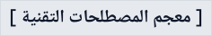

  <h4>بسم الله الرحمن الرحيم</h4>

   
   
  
  
   
   
  
يحتوي على قائمة المصطلحات التقنية مع التعريب لها

---

## المقدمة

يهدف هذا المشروع إلى توفير قائمة شاملة من المصطلحات التقنية مع ترجمتها وتعريبها ليصبح مرجعاً للمطورين العرب.

## كيفية الاستخدام

بكل بساطة ، ادخل على [الموقع الإلكتروني](https://arabic-tech-glossary.vercel.app) و تصفح قائمة المصطلحات.

## التقنيات المستخدمة

- Next.js
- Tailwind CSS
- Hono
- Fuse.js
- swr
- Zustand
- TanStack Table
- Typescript

## المساهمة

دعمك ومساهمتك تهمُّني. يمكنك المساهمة من خلال إضافة المصطلحات أو نشر الموقع الإلكتروني لينتشر المشروع أو عمل **star** للمشروع!

### إضافة المصطلحات

نعتمد في تخزين البيانات على ملفات بيانات من نوع JSON. لإضافة مصطلحات جديدة يمكنك تعديل ملف `/src/data/terms.json` وإضافة التعريب والمصطلح بالإنجليزية مع الوصف وافتح Pull request.

أو يمكنك عمل Issue للإبلاغ عن أي مشاكل أو أخطاء حالية.
